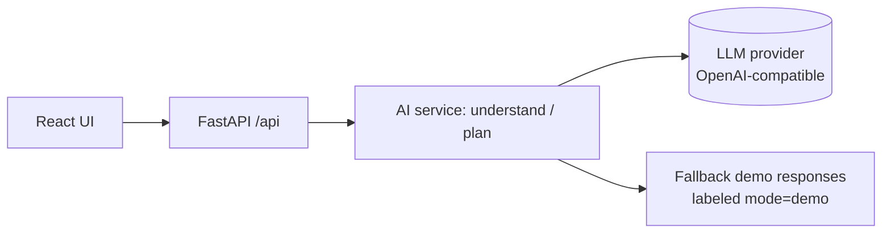
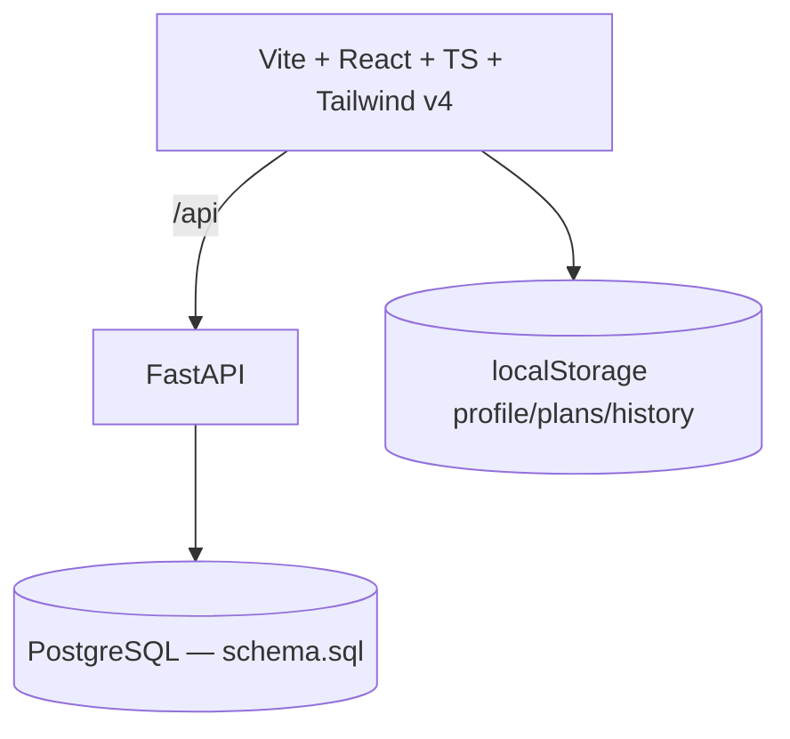

# AccessAI — Turn complexity into opportunity.

AccessAI is an adaptive AI accessibility layer that transforms complex information into
personalized understanding and action: clear explanations, goal-to-plan roadmaps,
progress insights, and an accessibility-first interface.

> Not "an AI chatbot for students". It adapts explanations, plans, and recommendations
> to the learner — confusion → understanding → action → progress.

## Problem

Students often have information that is technically available but practically inaccessible:
dense explanations, long articles, jargon, overwhelming material, and no clear next step.
Generic chatbots answer without knowing your goal, level, style, or progress.

## Solution

- **Understand (flagship):** paste text → simple explanation, key ideas, terms, example,
  action steps, 3-question quick check, plus "Explain again" (simpler / detailed / example / steps / analogy).
- **Study planner:** goal → milestones → tasks with estimates, order, daily actions, visual progress tree.
- **Adaptive AI:** recommendations use skill level, style, history, and completions — and explain WHY.
- **Accessibility mode:** larger text, readability, reduced complexity, focus mode, keyboard support, reduced motion.
- **Insights:** completion, streak, strongest/needs-practice areas, next step (Recharts).
- **Knowledge memory:** profile + plans + history persist in localStorage; "Welcome back. You were working on X."
- **Honest fallback:** loading states, retry, and clearly labeled Demo vs Live responses. Never fakes AI output.

## AI architecture



Reusable AI functions: `explainContent()`, `generatePlan()` (frontend `src/lib/ai.ts`
+ backend `main.py::understand/make_plan`). Server holds the key; frontend never sees secrets.

## System architecture



## Tech stack

Frontend: React 19, TypeScript, Vite, Tailwind CSS v4, Recharts, Lucide icons.
Backend: FastAPI, Pydantic validation, OpenAI-compatible LLM client, CORS, rate-limit-ready structure.
Database: PostgreSQL (`backend/schema.sql`: users, profiles, preferences, goals, milestones,
tasks, learning_sessions, ai_interactions, progress).

## How to run locally

Frontend (works offline, no key needed):

```bash
cd "New folder/AccessAI/frontend"
npm install
npm run dev      # http://localhost:5173
```

Backend (optional; enables Live AI):

```bash
cd "New folder/AccessAI/backend"
python -m venv .venv
.venv\Scripts\activate        # Windows
pip install -r requirements.txt
copy .env.example .env        # set OPENAI_API_KEY
uvicorn main:app --reload --port 8000
```

Set `VITE_API_URL=http://localhost:8000` in `frontend/.env` to use live endpoints
(dev server also proxies `/api` → `:8000`).

## Environment variables

| Var | Where | Purpose |
|---|---|---|
| `VITE_API_URL` | frontend | Backend base URL (empty = offline demo mode) |
| `OPENAI_API_KEY` | backend | LLM key, server-side only |
| `OPENAI_MODEL` | backend | Default `gpt-4o-mini` |
| `OPENAI_BASE_URL` | backend | OpenAI-compatible endpoint |
| `ALLOWED_ORIGINS` | backend | CORS origins |
| `DATABASE_URL` | backend | PostgreSQL connection |

## Demo (2–3 minutes, judges)

1. Open app → **Try Demo** (loads: goal "Learn Python fundamentals", 42%†, topic "Functions", action "Practice function parameters"). †Illustrative example.
2. **Understand** → sample text preloaded → **Make It Clear** → explanation, terms, example.
3. **Test understanding** → answer 3 questions → **Check answers** → history + quiz chart update.
4. **Study Plan** → generate or open demo roadmap → complete one task → progress % changes.
5. **Progress** → insight explains WHY the next step was recommended.
6. Toggle **Accessibility** → larger text / focus mode live.
7. Close: "AccessAI doesn't just answer questions. It helps people understand, act, and progress."

## Screenshots

Capture: landing, dashboard, Understand + explanation, study plan, progress/insights,
accessibility mode on. (Docs target; add PNGs under `docs/`.)

## Challenges & trade-offs

- No hardcoded "AI": real service layer + labeled fallback so the app always runs for judges.
- localStorage memory instead of full auth/DB wiring for hackathon reliability; PostgreSQL schema provided for production path.
- No router dependency: tiny internal view router keeps bundle small and avoids setup failures.

## Future improvements

Supabase Auth, server-persisted plans/progress, spaced-repetition scheduling, file/PDF ingest,
multi-language simplification, teacher dashboards, exportable study guides.

## Impact

For students facing dense material, self-learners entering technical fields, and anyone needing
a different explanation style. Empowerment-focused; does not replace teachers. No fake users,
testimonials, partnerships, or statistics — demo numbers are labeled "Demo data"/"Illustrative example".

## Team

Built as a hackathon entry for the ML Empowerment Build Challenge 3.0.
# AccessAI
